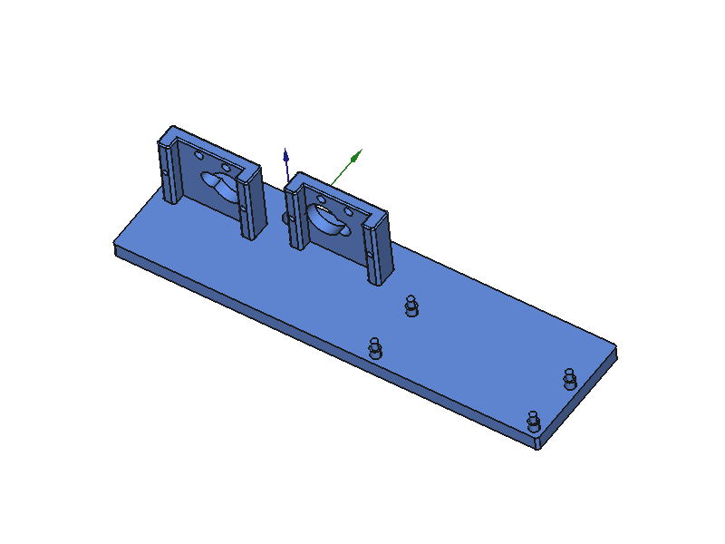
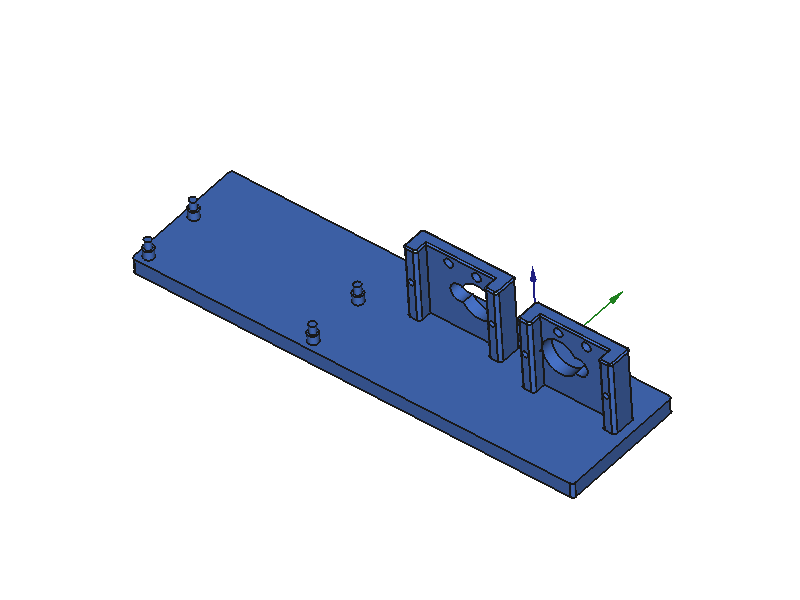
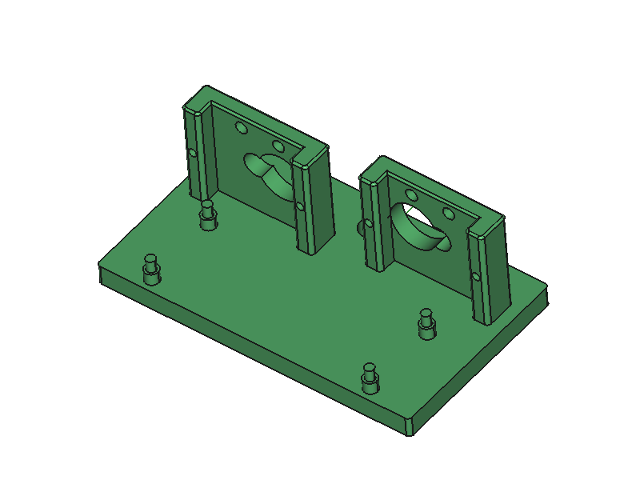
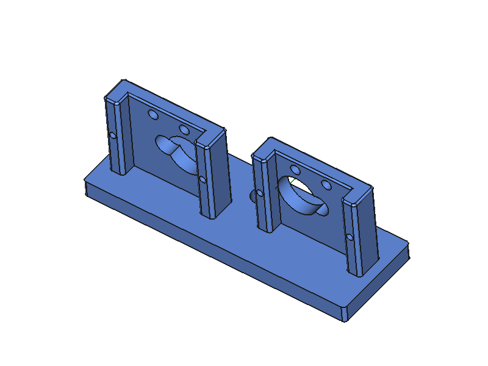
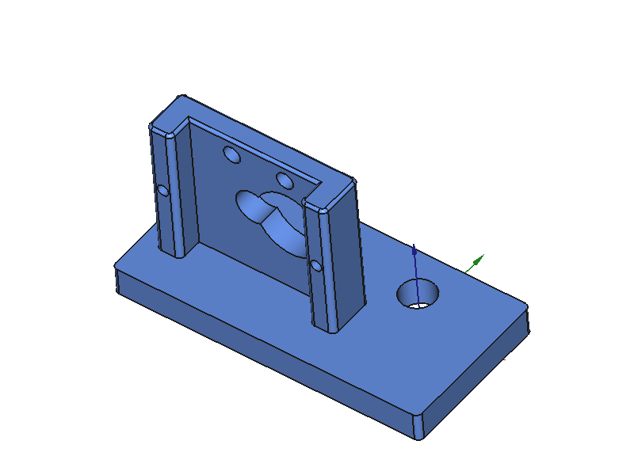

# Servo

3D-printable servo bracket designs for the Train Order signal mechanism on the model
railroad layout. Two micro-servos mount side-by-side above the roadbed; their arms drive
signal arms via Bowden-cable wires through the base mast hole.

## Parts

### TrainOrderServoInLine v2 — full assembly with PCA9685 board

| Body | Board position | Base footprint |
|------|---------------|----------------|
| `Body` | +X side of brackets | 150 × 42 mm |
| `Body_Flipped` | −X side (mirrored) | 150 × 42 mm |
| `BodyBoardBehind` | −Y direction (compact) | 80 × 47 mm |

**Body (board +X)**


**Body_Flipped (board −X)**


**BodyBoardBehind (board −Y)**


---

### TrainOrderServoBracketsOnly v1 — two brackets, no board

For installations where the PCA9685 is mounted elsewhere. Mast hole and wire access
hole retained. Base 80 × 27 mm.



---

### TrainOrderServoSingleBracket v1 — one bracket

Single-signal installations. Mast hole retained. Base 55 × 27 mm.



---

### Legacy: TrainOrderServoInLine v1

Original manual PartDesign file (`freecad/TrainOrderServoInLine.FCStd`). Both brackets
at the same Y position — arm interference bug present. Kept for reference only.

## Key fix in v2

Bracket 2 is shifted **+4 mm in Y** so the servo arms sweep in separate planes
(2.5 mm clearance between 1.5 mm-thick arms).

## Print Settings

| Setting | Value |
|---------|-------|
| Material | PLA |
| Printer | Prusa Core One |
| Supports | None |
| Infill | ≥ 20% |

## Project Structure

```
Servo/
├── README.md
├── DESIGN.md                          # geometry reference + variant descriptions
├── .claude/CLAUDE.md                  # project context for Claude sessions
├── docs/                              # ISO screenshots
│   ├── inline_body.png
│   ├── inline_body_flipped.png
│   ├── inline_board_behind.png
│   ├── brackets_only.png
│   └── single_bracket.png
├── freecad/                           # FreeCAD source files
│   ├── TrainOrderServoInLine_v2.FCStd
│   ├── TrainOrderServoBracketsOnly_v1.FCStd
│   ├── TrainOrderServoSingleBracket_v1.FCStd
│   └── TrainOrderServoInLine.FCStd    # legacy v1
├── scripts/
│   └── generate_trainorderservo.py   # parametric generator (Part module)
├── printed_files/                     # STL exports
└── images/                            # legacy reference drawings
```

## Regenerating

```bash
# From FreeCAD MCP bridge — overwrites all v2 FCStd files and STLs:
exec(open("scripts/generate_trainorderservo.py").read())
run("/home/abyrne/Projects/Trains/CADlayout/Servo")
```

## License

GNU General Public License v3.0
