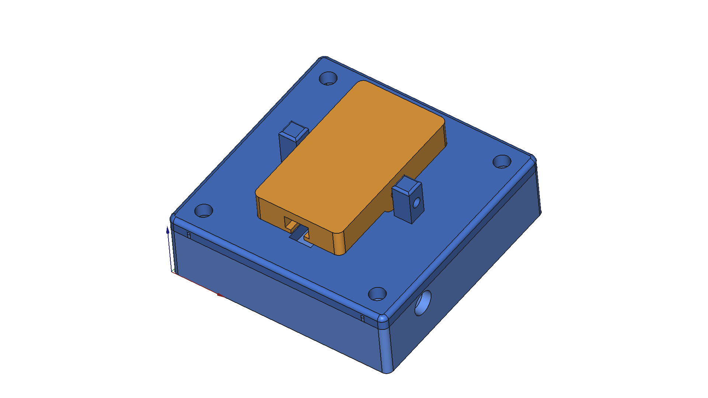

# SwitchToggle

Fascia-mounted seesaw lever to throw a BluePoint under-table switch machine via a
Sullivan Gold-N-Rod #504 R/C Bowden cable. Two red LEDs indicate the set route.



## Parts

| Part | Qty | Description |
|------|-----|-------------|
| Shell | 1 | 50×50×12mm hollow tray, open front face |
| FrontPlate | 1 | 50×50×3mm plate + 8mm pivot posts |
| Lever | 1 | 20×35×6mm paddle with Ø8mm cylinder fulcrum |
| M2×25mm pivot pin | 1 | Through posts and cylinder |
| 2-56 stud + nut | 1 | Pre-assembled; slides into T-slot from bottom |
| 5mm red LED | 2 | Top-left and bottom-right corners for route indication |
| JST-XH 2.5mm 3-pin | 1 | LED wiring connector |
| 470Ω resistor | 1 | At control panel end |
| M3 screws | 4 | Corner fascia mount |

## Quick Start

### Print Settings

| Setting | Value |
|---------|-------|
| Material | PETG |
| Printer | Prusa Core One |
| Supports | None |
| Orientation | Shell and FrontPlate: open face up; Lever: flip 180° around X in PrusaSlicer |

### Regenerate from Script

```bash
# From FreeCAD Python console:
exec(open("/home/abyrne/Projects/Trains/CADlayout/SwitchToggle/scripts/generate_switchtoggle.py").read())
```

### Assembly Notes

1. Install LEDs in shell side walls (top LED in left wall Y=38, bottom LED in right wall Y=12)
2. Route LED wires through shell interior; exit through 5mm cable hole in back wall
3. Glue FrontPlate to shell front rim (alignment pegs register it)
4. Insert lever between posts; pass M2 pin through; retain with M2 nut
5. Slide pre-assembled stud+nut into T-slot from bottom edge
6. Route Gold-N-Rod inner rod through fascia and shell slots; thread onto stud

The module can be installed flipped 180° on the fascia to reverse Normal/Reverse sense.

## Project Structure

```
SwitchToggle/
├── README.md              # This file
├── DESIGN.md              # Full technical specification
├── PLAN_v2.md             # Future improvements
├── freecad/               # FreeCAD source files
│   └── SwitchToggle.FCStd
├── images/                # ISO screenshots
│   └── switchtoggle_iso.png
├── printed_files/         # STL exports
│   ├── Shell.stl
│   ├── FrontPlate.stl
│   └── Lever.stl
└── scripts/               # Parametric build script
    └── generate_switchtoggle.py
```

## License

GNU General Public License v3.0 — see repository root.
