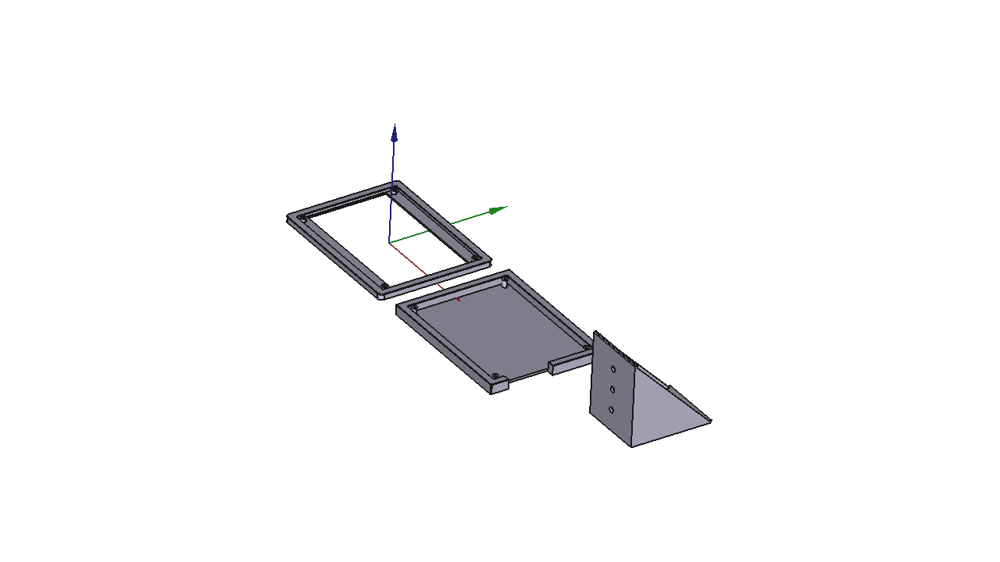

# YardmasterTerminal

Fascia-mounted enclosure for the **rpi3-yard** Yardmaster terminal, housing an
ELECROW 7" 1024×600 IPS touchscreen at a 45° viewing angle. Three-piece design:
a front bezel, a component enclosure, and a wedge bracket that sets the tilt.



## Parts

| Part | File | Description |
|------|------|-------------|
| **Bezel** | `YardmasterTerminal_Bezel_v3.stl` | 185×144×7mm box lid; 166×100mm display opening; "YARDMASTER" label; 4× M3 counterbores |
| **Enclosure** | `YardmasterTerminal_Enclosure_v3.stl` | 185×144×13.6mm box; 4× M3 boss cylinders; connector slot on port (−X/left) side; 45° back-corner chamfers for wedge seating |
| **Wedge** | `YardmasterTerminal_Wedge_v3.stl` | 80mm-wide 45° L-bracket; 3× fascia mounting holes; M3 lock screw |

**Hardware:** 4× M3×12 socket-head screws (bezel-to-enclosure), 1× M3 lock screw
(wedge bottom leg), #6 wood screws for fascia mounting.

## Assembly

Assembly order (front → back):

1. Place ELECROW board tabs onto the 4 bezel standoffs
2. Seat the enclosure over the board — boss cylinders align with the standoffs
3. Drive 4× M3×12 socket-head screws from the bezel front face into the enclosure bosses
4. Press the enclosure's back-bottom corner into the wedge V-groove; the 45° chamfers
   on the enclosure's back face engage the wedge leg ends to retain it
5. Mount the wedge back leg flush against the fascia with #6 wood screws through
   the 3 counterbored holes
6. Tighten the M3 lock screw through the wedge bottom leg for final retention

## Print Settings

| Setting | Bezel | Enclosure | Wedge |
|---------|-------|-----------|-------|
| Orientation | Front face down | Back face down | Bottom leg down |
| Material | PLA | PLA | PLA |
| Supports | None | None | None |
| Layer height | 0.15 mm | 0.15 mm | 0.15 mm |

## Board Reference

ELECROW 7" LCD Display-C, 1024×600 Pixel, USB Touch Rev3.3

| Dimension | Value |
|-----------|-------|
| Board body | 165×107 mm |
| Overall (with tabs) | 165×124 mm |
| Mounting hole spacing | 157×115 mm c-t-c |
| Board thickness | 1.6 mm |
| LCD panel face | 165×99 mm |
| Panel-to-board depth | 7 mm |

Ports (right edge of board when viewed from back, lower-left when viewed from
front/display side): Backlight switch → 2× micro-USB Touch → micro-HDMI Display.
The connector slot in the enclosure left (−X) wall spans Y = 4–60 mm from the
board bottom edge to clear all ports.

## Regenerate from Script

```bash
# From FreeCAD Python console:
exec(open("/home/abyrne/Projects/Trains/CADlayout/YardmasterTerminal/scripts/generate_yardmasterdisplay.py").read())
build()
```

## Project Structure

```
YardmasterTerminal/
├── README.md                          # This file
├── images/
│   └── yardmasterterminal_iso.png     # ISO screenshot
├── freecad/
│   └── YardmasterTerminal.FCStd      # FreeCAD source
├── drawings/
│   └── YardmasterTerminal_v3.svg     # TechDraw: 9-view orthographic (scale 1:3)
├── printed_files/                     # Production STL exports
│   ├── YardmasterTerminal_Bezel_v3.stl
│   ├── YardmasterTerminal_Enclosure_v3.stl
│   └── YardmasterTerminal_Wedge_v3.stl
└── scripts/
    └── generate_yardmasterdisplay.py  # Parametric build script
```

## License

GNU General Public License v3.0 — see repository root.
